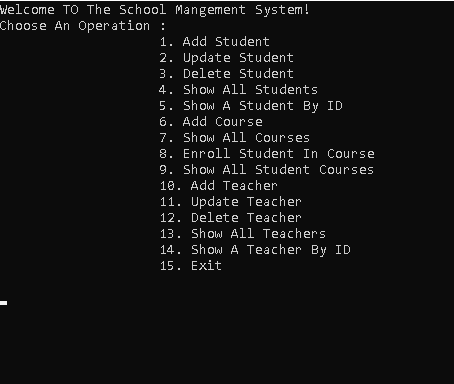

# 📚 School Management Console System

A robust and interactive **C# Console Application** designed to streamline school administration. This system manages core academic entities including **Students, Teachers, Courses, and Enrollments** using Object-Oriented Programming (OOP) principles and efficient data querying.

---

## 🛠️ Tech Stack & Concepts Learnt

* **Language:** C# (.NET Core)
* **Database:** SQL Server
* **ORM:** Entity Framework Core (EF Core)
* **Data Querying:** LINQ (Language Integrated Query)
* **Architecture:** Object-Oriented Programming (OOP) & CRUD Operations

---

## 🚀 Key Features

### 🧑‍🎓 Student Management
* Add, update, and delete student records.
* View all registered students or search for a specific student by their unique ID.

### 👨‍🏫 Teacher Management
* Complete CRUD operations for instructors and teachers.
* Detailed views for all teachers and individual profiles by ID.

### 📖 Courses & Enrollments
* Create and manage academic courses.
* **Enrollment System:** Dynamically link students to specific courses.
* View all courses or list all courses assigned to a specific student.

---

## 📸 System Preview

Here is the interactive menu of the console application:



---

## ⚙️ How to Run the Project

1. **Clone the repository:**
   ```bash
   git clone [https://github.com/Kimcpu/school-management-system-with-C-.git](https://github.com/Kimcpu/school-management-system-with-C-.git)
   
2. **Database Setup**:

Ensure you have SQL Server installed.

Run EF Core migrations to create the database:

```bash
dotnet ef database update
```
3. **Run the application**:

Open the solution (ConsoleApp12.slnx) in Visual Studio and press F5 or click Run.
